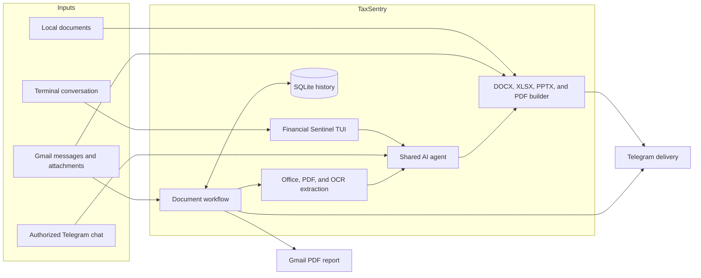
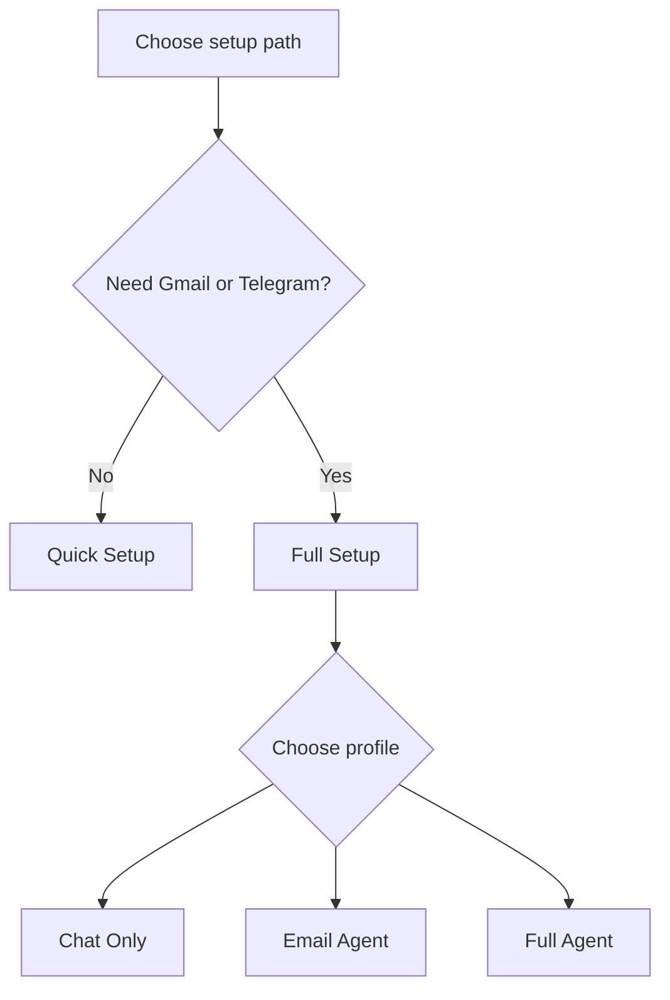
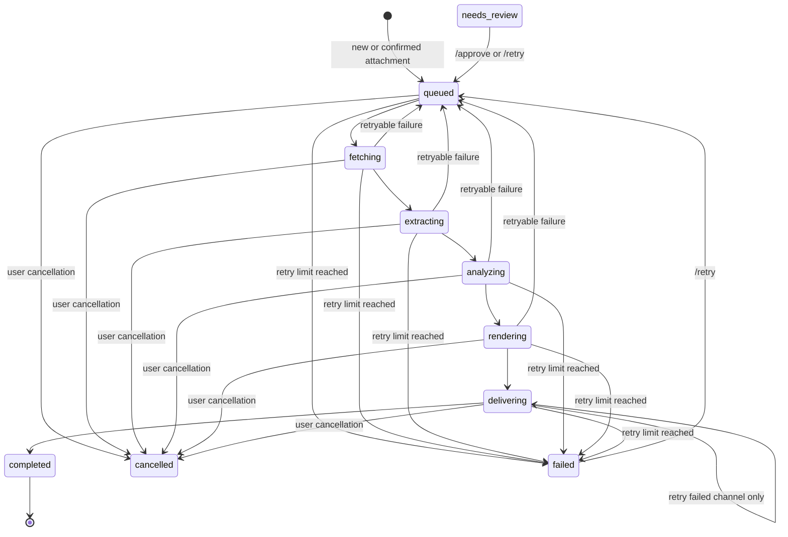
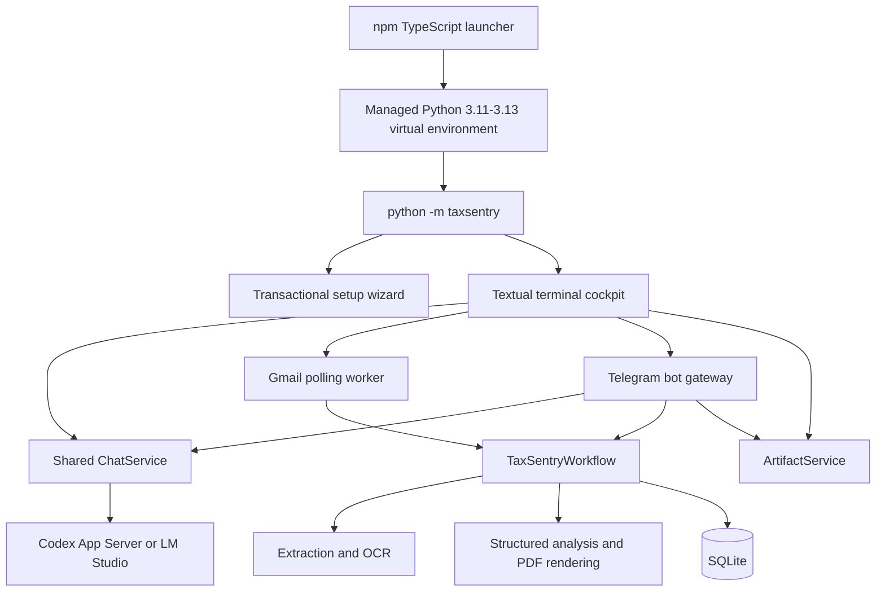

<div align="center">

# TaxSentry

### Financial Sentinel for Vietnamese business, reporting, and tax workflows

**A terminal-first AI agent that connects conversations, Gmail, financial documents, generated office files, PDF reports, and Telegram in one local workspace.**

[](https://www.npmjs.com/package/taxsentry)
[](https://github.com/thienan230427/TaxSentry/actions/workflows/cross-platform.yml)
[](https://www.python.org/)
[](https://nodejs.org/)
[](LICENSE)

[Quick start](#quick-start) · [Features](#features) · [Setup](#interactive-setup) · [Commands](#command-reference) · [Architecture](#architecture) · [Troubleshooting](#troubleshooting)

</div>

> [!IMPORTANT]
> TaxSentry assists with extraction, analysis, and reporting. It does not file taxes or make financial, legal, or operational decisions. A qualified person should verify material conclusions against the original evidence before acting on them.

## Overview

TaxSentry is a local, terminal-first assistant for Vietnamese financial and business workflows. It can chat through an AI provider, search Gmail, process new attachments, extract data from office documents and scans, generate polished files, create structured PDF reports, and deliver results through Gmail and Telegram.

The npm package contains a small TypeScript launcher and the matching Python application wheel. On first use, the launcher creates an isolated Python environment under `~/.taxsentry/runtime/venv`, installs the bundled core, and forwards commands to it. Application data and credentials remain local to the machine.



## Features

### Terminal AI workspace

- Streaming chat inside a Textual-based terminal interface.
- Vietnamese and English interface modes selected during setup.
- Slash-command completion, recent jobs, current integration state, and session controls.
- One serialized chat service shared by the terminal and Telegram gateway.
- Persistent conversation history and workflow events in SQLite.
- Safe cancellation and clean shutdown of background services.

### Gmail search and automation

- Natural-language Gmail questions in Vietnamese or English.
- Explicit Gmail search syntax through `/gmail search <query>`.
- Full message reading through `/gmail read <uid>`.
- Confirmation before processing manually searched historical messages.
- Automatic polling for new messages with supported attachments after the setup marker.
- Coverage of Gmail All Mail, Spam, and Trash when those mailboxes are available; Sent and Drafts are excluded.
- Gmail labels for `Processing`, `Completed`, `NeedsReview`, and `Failed` workflow states.
- Reports are sent back to the connected Gmail account.

TaxSentry supports messages from every sender. Automatic processing starts only after the per-mailbox UID markers captured during setup, so existing mailbox history is not processed unexpectedly. Historical searches remain available and require an explicit `/gmail process` confirmation.

### Document extraction and reporting

- Direct text extraction from DOCX and PPTX.
- Financial workbook analysis for XLSX, including multi-sheet and formula-heavy files.
- Direct PDF text extraction with OCR fallback for scanned pages.
- OCR for PNG, JPG, and JPEG with configurable language packs.
- Legacy DOC, XLS, and PPT conversion through LibreOffice when installed.
- Structured AI reports with executive summary, evidence, missing data, risks, recommendations, and confidence.
- PDF report rendering and auditable job, report, attachment, delivery, and event records.
- Retry with bounded backoff, per-stage timeouts, cancellation, and duplicate-work protection.
- Channel-aware delivery retries: if Gmail succeeds and Telegram fails, only the failed delivery is retried.

### Artifact generation

TaxSentry can create new office documents directly from a prompt, selected Gmail messages, or local files:

| Output | Command type | Optional template |
| --- | --- | --- |
| Word document | DOCX | `.docx` |
| Spreadsheet | XLSX | `.xlsx` |
| Presentation | PPTX | `.pptx` |
| Report document | PDF | Not applicable |

Generated files use Vietnamese business conventions by default, including VND and `dd/mm/yyyy`. The agent is instructed not to invent missing values and to identify incomplete evidence. Outputs are saved under `~/.taxsentry/outputs` and sent to configured Telegram chats when automatic artifact delivery is enabled.

### AI providers

| Provider | How it connects | Best for |
| --- | --- | --- |
| **Codex / ChatGPT** | Official Codex App Server with browser or device-code authentication | Hosted models and Codex accounts |
| **LM Studio** | OpenAI-compatible local endpoint, default `http://127.0.0.1:1234/v1` | Local and private model execution |

Codex uses an isolated home at `~/.taxsentry/codex`. LM Studio models are discovered from the configured endpoint, with a manual model-ID fallback.

### Telegram gateway

- Only chat IDs saved in `director.telegram_chat_ids` are authorized.
- Plain text uses the same assistant and session service as the terminal.
- Gmail search, document creation, job status, retry, approval, cancellation, and latest-report commands are available.
- Generated files and completed Gmail reports can be delivered to every configured chat.
- Telegram Bot API document delivery is limited to 50 MB.

## Quick start

### 1. Install prerequisites

- [Node.js 22 or later](https://nodejs.org/)
- [uv](https://docs.astral.sh/uv/getting-started/installation/)
- Python 3.11, 3.12, or 3.13 available to `uv`
- Codex CLI or a running LM Studio server

Optional components:

- Tesseract OCR with `vie` and `eng` language data for images and scanned PDFs.
- LibreOffice for legacy `.doc`, `.xls`, and `.ppt` files.
- Gmail App Password for Email Agent or Full Agent mode.
- Telegram bot token for Full Agent mode.

### 2. Install TaxSentry

```powershell
npm install -g taxsentry
taxsentry --version
taxsentry --help
```

### 3. Configure and validate

```powershell
taxsentry setup
taxsentry doctor
taxsentry
```

The first command that enters the Python core creates the managed runtime automatically. Later package versions reinstall the bundled wheel when the runtime version sentinel changes.

## Installation options

### npm — recommended

```powershell
npm install -g taxsentry
taxsentry setup
```

The npm launcher handles `--help` and `--version` directly. All other arguments are forwarded to `python -m taxsentry` in the isolated managed runtime.

### uv tool — direct Python installation

```powershell
uv tool install git+https://github.com/thienan230427/TaxSentry.git
taxsentry setup
taxsentry doctor
```

### Source checkout — development

```powershell
git clone https://github.com/thienan230427/TaxSentry.git
cd TaxSentry
uv sync --locked --extra dev
uv run taxsentry setup
```

If TaxSentry detects a v1 profile, it moves the old profile to a timestamped backup directory before creating the v2 profile. Existing data is not silently deleted.

## Interactive setup

Run:

```powershell
taxsentry setup
```

The bilingual wizard offers two paths:

- **Quick Setup** configures the provider and model, disables Gmail and Telegram, and opens chat quickly.
- **Full Setup** lets you select a profile and configure every enabled service.

### Profiles

| Profile | Terminal AI | Gmail workflow | Telegram gateway | Recommended use |
| --- | :---: | :---: | :---: | --- |
| **Chat Only** | Yes | No | No | Conversations and local document generation |
| **Email Agent** | Yes | Yes | No | Gmail attachment processing and email reports |
| **Full Agent** | Yes | Yes | Yes | Gmail automation plus remote Telegram access |



### Setup sequence

1. Choose Vietnamese or English.
2. Select Quick Setup or Full Setup.
3. Select Codex / ChatGPT or LM Studio.
4. Authenticate and choose a discovered or custom model.
5. For Gmail, enter the connected account, polling interval, and 16-character App Password.
6. For Telegram, enter one or more chat IDs and a bot token.
7. Review the summary and authenticate the selected services.
8. Save non-secret configuration only after validation succeeds.

The wizard keeps the existing configuration unchanged when it is cancelled or validation fails. Gmail App Passwords and Telegram bot tokens are stored in the operating-system keyring, not in `config.json`.

### Gmail preparation

1. Enable Google 2-Step Verification.
2. Create a 16-character [Google App Password](https://myaccount.google.com/apppasswords).
3. Run `taxsentry setup` and enter the Gmail address and App Password.
4. Run `taxsentry doctor` to verify the keyring entry, worker marker, OCR runtime, and provider.

The same Gmail account is used for IMAP reading, SMTP delivery, and receiving generated reports.

### Telegram preparation

1. Create a bot with [BotFather](https://t.me/BotFather).
2. Obtain the numeric chat IDs that may use the bot.
3. Enter the IDs and bot token during Full Setup.
4. TaxSentry verifies the token before replacing the saved secret.

## Command reference

### CLI commands

| Command | Purpose |
| --- | --- |
| `taxsentry` | Run setup on first use, then open the Financial Sentinel TUI. |
| `taxsentry --help` | Show public commands. |
| `taxsentry --version` | Print the installed version. |
| `taxsentry setup` | Create or update the local profile. |
| `taxsentry status` | Show provider, Gmail, Telegram, LibreOffice, and configuration status. |
| `taxsentry doctor` | Check the provider and enabled integrations. |
| `taxsentry doctor --fix` | Create required directories and attempt to install missing Tesseract components. |
| `taxsentry update` | Update through the stable channel for the detected installation type. |
| `taxsentry update --main` | Explicitly update the Python core from GitHub `main`. |

### Terminal commands

Type `/` to show command completion. Use the arrow keys to select a command, `Tab` to complete it, and `Esc` to close the suggestions.

| Command | Purpose |
| --- | --- |
| `/help` | Show commands and keyboard shortcuts. |
| `/status` | Show provider, Gmail, Telegram, and Office status. |
| `/gmail` | List recent Gmail results using the default query. |
| `/gmail search <query>` | Search up to 20 messages with Gmail search syntax. |
| `/gmail read <uid>` | Read one message, including body and attachment names. |
| `/gmail process <uid\|all>` | Confirm processing for selected search results. |
| `/create <docx\|xlsx\|pptx\|pdf> <request>` | Generate a document. Add `--template <path>` for a compatible Office template. |
| `/cancel <job-prefix>` | Request cancellation of an active job. |
| `/jobs` | Show recent job IDs, states, subjects, and retry counts. |
| `/report` | Show the executive summary from the latest report. |
| `/retry [job-prefix]` | Requeue a failed or review-pending job. |
| `/approve [job-prefix]` | Approve and requeue a job in `needs_review`. |
| `/new` | Start a new conversation session. |
| `/exit` | Stop background services and exit safely. |

Examples:

```text
Which unread emails arrived today?
/gmail search from:invoice@example.com has:attachment newer_than:30d
/gmail read 1842
/gmail process 1842
/create pdf Summarize the current month's Gmail reports
/create xlsx Build a management dashboard from "D:\Reports\June.xlsx"
/create pptx Create a board presentation --template "D:\Templates\Board.pptx"
```

### Telegram commands

| Command | Purpose |
| --- | --- |
| `/status`, `/jobs` | List recent jobs and their states. |
| `/report` | Send the latest generated PDF. |
| `/gmail search <query>` | Search Gmail and retain results for confirmation. |
| `/gmail process <uid\|all>` | Process confirmed Gmail results. |
| `/create <docx\|xlsx\|pptx\|pdf> <request>` | Generate a file and return its completion state. |
| `/retry <job-prefix>` | Requeue a failed or review-pending job. |
| `/approve <job-prefix>` | Approve a review-pending job. |
| `/cancel <job-prefix>` | Cancel an active workflow job. |
| Plain text | Chat with the shared TaxSentry assistant. |

## Supported documents

| Extension | Validation and extraction |
| --- | --- |
| `.docx` | Open XML package validation and document text extraction. |
| `.xlsx` | Open XML package validation and native financial workbook parsing. |
| `.pptx` | Open XML package validation and slide text extraction. |
| `.pdf` | PDF signature validation, direct text extraction, then OCR fallback when text is sparse. |
| `.png` | PNG signature validation and Tesseract OCR. |
| `.jpg`, `.jpeg` | JPEG signature validation and Tesseract OCR. |
| `.doc`, `.xls`, `.ppt` | Compound-file signature validation, then headless LibreOffice conversion. |

Macro-enabled `.docm`, `.xlsm`, and `.pptm` files are not accepted. Email and document content is treated as untrusted data: TaxSentry does not execute macros, scripts, links, or instructions embedded in source files.

Default attachment and local-source size limit: **100 MB**. Open XML archive expansion is capped at **200 MB**. Both limits protect the local workflow from unexpectedly large input.

## Gmail processing lifecycle



For every supported attachment, TaxSentry:

1. Creates a stable job identifier from the Gmail message identity and attachment SHA-256.
2. Validates the extension, MIME type, file signature, archive structure, and configured size limit.
3. Saves the validated attachment under `~/.taxsentry/downloads/<job-id>/`.
4. Extracts structured content or OCR text.
5. Requests a fixed-schema financial analysis from the configured provider.
6. Adds a visible warning when extraction or report confidence is below the configured threshold.
7. Renders a PDF and records the report in SQLite.
8. Sends the report to the connected Gmail account and configured Telegram chats.
9. Records successful channels so retries do not duplicate completed deliveries.
10. Applies the final Gmail workflow label.

## Architecture



### Runtime boundaries

- **TypeScript launcher:** discovers `uv`, creates the managed virtual environment, installs the bundled wheel, forwards signals, and forces UTF-8 for the Python child process.
- **Python core:** owns setup, providers, TUI, Gmail, Telegram, extraction, workflow state, storage, report rendering, artifact generation, and updates.
- **SQLite store:** records jobs, state transitions, approvals, reports, attachments, deliveries, workflow events, sessions, and messages.
- **OS keyring:** stores Gmail App Passwords and Telegram bot tokens.
- **Local profile:** stores non-secret configuration and generated workflow data under `~/.taxsentry` unless overridden.

## Configuration and local data

Default profile layout:

```text
~/.taxsentry/
├── config.json                 # non-secret configuration
├── taxsentry.db                # jobs, reports, events, deliveries, and chat history
├── sessions.jsonl              # reserved session path
├── logs/                       # runtime logs directory
├── run/                        # worker lock and runtime files
├── downloads/<job-id>/         # validated inputs and generated workflow reports
├── outputs/                    # documents created with /create
├── runtime/
│   ├── installed-version       # npm runtime version sentinel
│   └── venv/                   # isolated Python environment
└── codex/                      # isolated Codex App Server home
```

### Important settings

| Key | Default | Purpose |
| --- | --- | --- |
| `ui.language` | `vi` | Interface language: `vi` or `en`. |
| `provider.kind` | `lmstudio` | `lmstudio` or `codex`. |
| `provider.model` | empty | Selected model; empty lets the provider decide. |
| `gmail.enabled` | `true` | Enable Gmail search and the background worker. |
| `gmail.account` | empty | Gmail account used for IMAP and SMTP. |
| `gmail.process_after_uids` | `{}` | Per-mailbox automatic-processing markers. |
| `director.telegram_chat_ids` | `[]` | Authorized Telegram chats and report destinations. |
| `telegram.enabled` | `false` | Enable the Telegram gateway and delivery. |
| `worker.poll_seconds` | `30` | Delay after each Gmail polling cycle. |
| `worker.max_retries` | `3` | Retry limit for workflow and delivery failures. |
| `worker.max_attachment_mb` | `100` | Per-file input limit. |
| `ocr.languages` | `vie`, `eng` | Tesseract language packs. |
| `ocr.minimum_confidence` | `70` | Extraction threshold used for report warnings. |
| `report.minimum_confidence` | `0.70` | Analysis threshold used for report warnings. |
| `artifacts.output_dir` | `~/.taxsentry/outputs` | Generated document directory. |

### Environment overrides

| Variable | Effect |
| --- | --- |
| `TAXSENTRY_HOME` | Move the complete TaxSentry profile. |
| `TAXSENTRY_CONFIG_FILE` | Override the JSON configuration path. |
| `TAXSENTRY_MEMORY_DB` | Override the SQLite database path. |
| `TAXSENTRY_UV` | Point the npm launcher to a specific `uv` executable. |
| `CODEX_CLI_PATH` | Point TaxSentry to a specific Codex executable. |

## Security and reliability

- Secrets are stored in the operating-system keyring and excluded from persisted JSON.
- Incoming attachments must match the allowed extension, MIME type, and binary signature.
- Open XML files must contain their required package members and stay within the expanded-size limit.
- File names are reduced to their base name before saving, preventing attachment path traversal.
- Gmail and document text is placed in prompts as untrusted source data, with explicit instructions not to follow embedded commands.
- Job identity includes the Gmail message identity and attachment SHA-256 to avoid duplicate processing.
- Gmail delivery uses a stable message ID and checks Sent mail before sending again.
- Successful delivery channels are recorded independently for safe retries.
- Provider analysis, extraction, Gmail access, and delivery have configurable timeouts.
- Telegram commands and data are restricted to configured chat IDs.
- Updates refuse to reset, stash, or overwrite a dirty Git working tree.

Never commit App Passwords, bot tokens, OAuth data, `.env` files, databases, downloaded attachments, generated reports, or local runtime directories.

## Updating

```powershell
taxsentry update
taxsentry update --main
```

| Installation | Stable update | `--main` behavior |
| --- | --- | --- |
| Git clone | Fast-forward the configured upstream, then run `uv sync --locked` | Requires the checked-out branch to be `main`; fast-forwards `origin/main`. |
| Global npm | Install a newer `taxsentry@latest` only when the registry version is greater | Reinstall the managed Python core from GitHub `main`. |
| uv tool | Run `uv tool upgrade taxsentry-agent` | Force-install the Python package from GitHub `main`. |

Restart the TUI after an update. Git-based updates require a clean working tree and never switch branches automatically.

## Troubleshooting

Start with:

```powershell
taxsentry status
taxsentry doctor
taxsentry doctor --fix
```

| Symptom | Cause | Resolution |
| --- | --- | --- |
| `uv` not found | The npm launcher cannot create its Python runtime. | Install `uv`, reopen the terminal, or set `TAXSENTRY_UV`. |
| No compatible Python | `uv` cannot find Python `>=3.11,<3.14`. | Install Python 3.11, 3.12, or 3.13 and rerun TaxSentry. |
| Gmail rejects the password | A normal password was used, the App Password is invalid, or 2-Step Verification is disabled. | Enable 2-Step Verification, create a new 16-character App Password, and rerun setup. |
| Gmail does not auto-process old mail | Automatic processing intentionally begins after setup markers. | Search history with `/gmail search`, inspect it, then confirm with `/gmail process`. |
| OCR language is missing | Tesseract or the `vie`/`eng` language data is unavailable. | Install the required language packs or run `taxsentry doctor --fix`. |
| Legacy Office file fails | LibreOffice is missing or conversion failed. | Install LibreOffice and confirm `soffice` is in `PATH`. |
| LM Studio check fails | The server is stopped, the URL is wrong, or no model is loaded. | Start LM Studio's local server, verify the `/v1` URL, and rerun setup. |
| Codex login cannot open a browser | Browser launch is unavailable. | Select device-code authentication in setup. |
| Telegram ignores a chat | Its numeric ID is not authorized. | Add the chat ID through `taxsentry setup`. |
| A job repeatedly fails | Input validation, provider, extraction, or delivery is failing. | Use `/jobs`, inspect the latest error, correct the dependency or credentials, then use `/retry`. |
| Git update refuses to run | The checkout is dirty or has no upstream. | Commit or stash changes yourself and configure an upstream. |
| Windows pytest temp failure | The default temporary-directory ACL blocks pytest. | Use a workspace-local `--basetemp` as shown below. |

## Development

### Python checks

```powershell
uv sync --locked --extra dev
uv lock --check
uv run ruff check src tests
uv run pytest -q
uv build
```

Windows fallback for restricted temporary folders:

```powershell
$env:TAXSENTRY_HOME='D:\TaxSentry\tmp-test-home'
$env:UV_CACHE_DIR='D:\TaxSentry\.uv-cache'
uv run pytest -q --basetemp=D:\TaxSentry\tmp-pytest -p no:cacheprovider
```

### npm launcher checks

```powershell
cd npm
npm ci
npm run typecheck
npm test
npm pack --dry-run --json
npm run smoke
```

The smoke test builds the Python wheel, packs the npm artifact, verifies that exactly one matching wheel is bundled, installs the tarball into an isolated prefix, creates the managed runtime, and exercises the installed launcher.

### Continuous integration

GitHub Actions validates:

- Python 3.11, 3.12, and 3.13 on Ubuntu.
- Python 3.12 on Windows and macOS.
- Ruff, pytest, lockfile consistency, and Python package builds.
- Node.js 24 launcher type-checks, tests, npm package contents, and smoke installation on Windows, macOS, and Ubuntu.

### Release checklist

Keep all version locations synchronized:

- `npm/package.json`
- `npm/package-lock.json`
- `pyproject.toml`
- `src/taxsentry/__init__.py`
- `uv.lock`

Then run the complete validation and inspect the actual npm package:

```powershell
cd D:\TaxSentry
uv lock --check
uv run ruff check src tests
uv run pytest -q

cd npm
npm run typecheck
npm test
npm run smoke
npm publish --dry-run
```

## Project structure

```text
TaxSentry/
├── .github/workflows/           # cross-platform CI
├── npm/
│   ├── src/                     # TypeScript launcher and runtime bootstrap
│   ├── scripts/                 # prepack and smoke-install validation
│   ├── tests/                   # Node.js launcher tests
│   └── dist/vendor/             # bundled Python wheel
├── src/taxsentry/
│   ├── bot/                     # Telegram command gateway
│   ├── core/                    # financial XLSX parser and PDF generator
│   ├── knowledge_base/          # Vietnamese tax knowledge context
│   ├── artifacts.py             # DOCX, XLSX, PPTX, and PDF generation
│   ├── cockpit.py               # terminal interface
│   ├── config.py                # profile paths and defaults
│   ├── extraction.py            # Office, PDF, and OCR extraction
│   ├── gmail.py                 # IMAP, SMTP, search, labels, and validation
│   ├── providers.py             # LM Studio and Codex App Server
│   ├── setup_wizard.py          # bilingual transactional setup
│   ├── store.py                 # SQLite jobs, reports, events, and sessions
│   ├── updater.py               # safe update channels
│   └── workflow.py              # document processing and delivery
├── tests/                       # Python unit and regression tests
├── stress_tests/                # representative financial workbooks
├── pyproject.toml               # Python package metadata
└── uv.lock                      # reproducible dependency lock
```

## Production checklist

- [ ] Run `taxsentry doctor` on the target machine.
- [ ] Confirm the selected provider and model.
- [ ] Verify Gmail IMAP and SMTP with the production App Password.
- [ ] Confirm the automatic-processing marker was captured after setup.
- [ ] Confirm Telegram bot ownership and every authorized chat ID.
- [ ] Verify Tesseract `vie` and `eng` language packs when OCR is required.
- [ ] Verify LibreOffice when legacy Office formats are required.
- [ ] Process one representative document end to end.
- [ ] Compare the generated report with the original source evidence.
- [ ] Test a delivery failure and retry without duplicating the successful channel.
- [ ] Back up `~/.taxsentry` according to the organization's retention policy.

## License

TaxSentry is released under the [MIT License](LICENSE).

---

<div align="center">

**TaxSentry — evidence first, automation with human accountability.**

</div>
