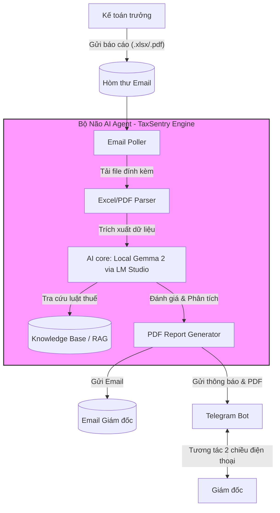

# 🌱 TaxSentry — AI Agent Giám Sát Kinh Doanh & Thuế

Chào mừng bạn đến với **TaxSentry** — Hệ thống AI Agent thông minh giúp tự động hóa quy trình giám sát hoạt động kinh doanh, phân tích báo cáo tài chính và cảnh báo rủi ro thuế theo các quy định thuế hiện hành tại Việt Nam.

Hệ thống được thiết kế đặc biệt nhằm tối ưu hóa tính bảo mật thông tin tài chính doanh nghiệp thông qua việc sử dụng **mô hình ngôn ngữ lớn (LLM) chạy hoàn toàn Local** (Gemma 2 via LM Studio).

---

## ✨ Các Tính Năng Cốt Lõi

1.  📬 **Tự động nhận báo cáo:** Quét hòm thư điện tử (IMAP), tự động tải và lọc các email báo cáo tài chính được gửi trực tiếp từ Kế toán trưởng.
2.  📊 **Đọc hiểu tài liệu phức tạp (Data Parser):** Trích xuất thông tin tự động từ file báo cáo kế toán định dạng Excel (`.xlsx`) hoặc `.pdf`, chuẩn hóa dữ liệu sang định dạng cấu trúc JSON sạch sẽ.
3.  🧠 **Phân tích Hiệu quả & Rủi ro Thuế (Local LLM & RAG):**
    *   Sử dụng mô hình **Gemma 2 (chạy Local trên LM Studio)** để phân tích các chỉ số tài chính (Doanh thu, Lợi nhuận, Biên lợi nhuận, Dòng tiền).
    *   Sử dụng cơ chế **RAG (Retrieval-Augmented Generation)** đối chiếu dữ liệu kế toán với các văn bản quy phạm pháp luật Thuế Việt Nam hiện hành để phát hiện và cảnh báo sớm các rủi ro thuế.
4.  📄 **Xuất báo cáo đa kênh:**
    *   Tự động xuất báo cáo phân tích tài chính & thuế thành một file PDF trực quan, chuyên nghiệp.
    *   Gửi email đính kèm file PDF báo cáo trực tiếp cho Giám đốc.
    *   Đồng thời đẩy tin nhắn tóm tắt kèm file PDF báo cáo qua Telegram Bot.
5.  💬 **Tương tác 2 chiều (Conversational Bot):** Cho phép Giám đốc chat trực tiếp với Telegram Bot trên điện thoại để tra cứu tiến độ, xem báo cáo lịch sử và hỏi đáp nhanh về số liệu tài chính của công ty.

---

## 🧭 Kiến Trúc Hệ Thống (Architecture)

---

## 🛠️ Công Nghệ Sử Dụng (Tech Stack)

*   **Ngôn ngữ lập trình chính:** Python 3.11+
*   **Mô hình AI:** Google Gemma 2 (Gemma-2-9b-it) chạy cục bộ qua **LM Studio** (`http://localhost:1234/v1`).
*   **Xử lý dữ liệu:** Pandas, OpenPyXL, PDFPlumber.
*   **Tạo báo cáo:** WeasyPrint / ReportLab (HTML/CSS to PDF conversion).
*   **Giao diện tương tác:** Telegram Bot API (`python-telegram-bot`).
*   **Cơ sở dữ liệu:** MySQL (Quản lý trực quan bằng MySQL Workbench, kết nối qua `mysql-connector-python` hoặc `pymysql`).

---

## 🗺️ Lộ Trình Triển Khai (4-Week Roadmap)

*   **Tuần 1: Thu thập dữ liệu & Parser**
    *   Cấu hình kết nối Email (IMAP), lọc thư của Kế toán trưởng.
    *   Viết parser đọc hiểu Excel và PDF, chuẩn hóa dữ liệu thành JSON.
    *   Lưu lịch sử giao dịch vào MySQL.
*   **Tuần 2: RAG & AI Analysis Engine**
    *   Xây dựng kho tài liệu Thuế Việt Nam (Vector DB hoặc công cụ tìm kiếm tri thức).
    *   Tích hợp LM Studio (Gemma 2 GGUF), thiết kế Prompt Chuyên gia Tài chính & Thuế.
    *   Kiểm thử phân tích dữ liệu kinh doanh & đối chiếu thuế.
*   **Tuần 3: Xuất báo cáo PDF & Phản hồi đa kênh**
    *   Tự động xuất báo cáo PDF đẹp mắt, chuyên nghiệp.
    *   Gửi mail tự động chứa báo cáo PDF cho Giám đốc.
    *   Gửi tin nhắn tóm tắt kèm PDF qua Telegram Bot.
*   **Tuần 4: Tương tác 2 chiều & Đóng gói**
    *   Xây dựng chức năng chat 2 chiều trên Telegram Bot.
    *   Cấu hình bảo mật nghiêm ngặt (chỉ cho phép ID Telegram được chỉ định).
    *   Đóng gói ứng dụng chạy nền liên tục bằng Docker/PM2.

---
*Phát triển bởi Thiên Ân — IT Student HUTECH desu~! 💖*
