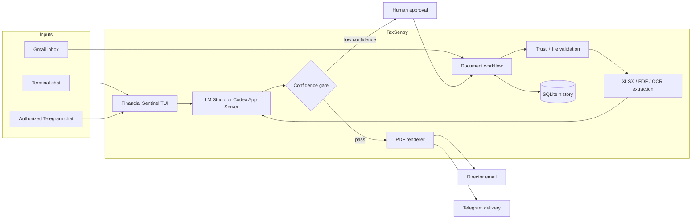
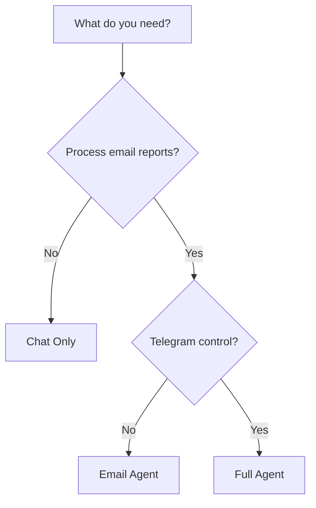
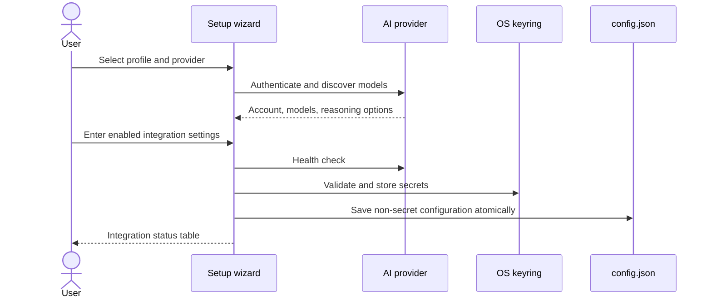
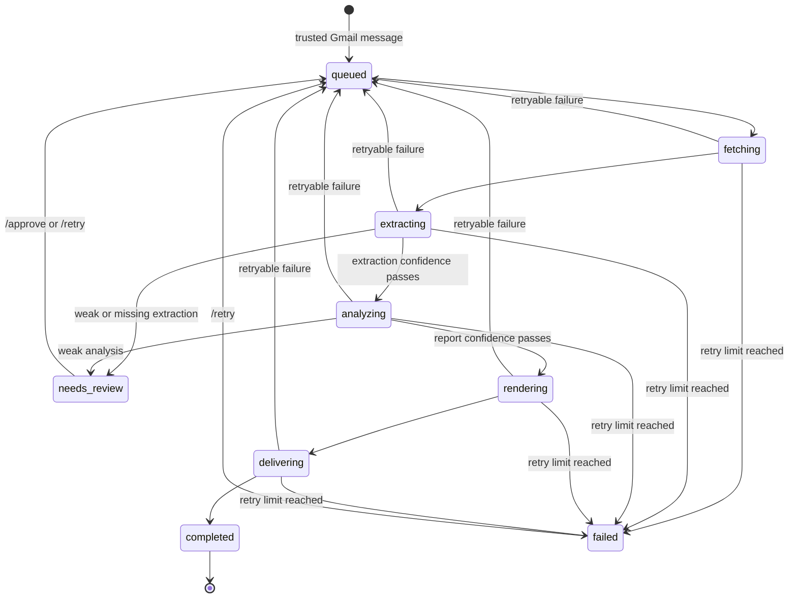
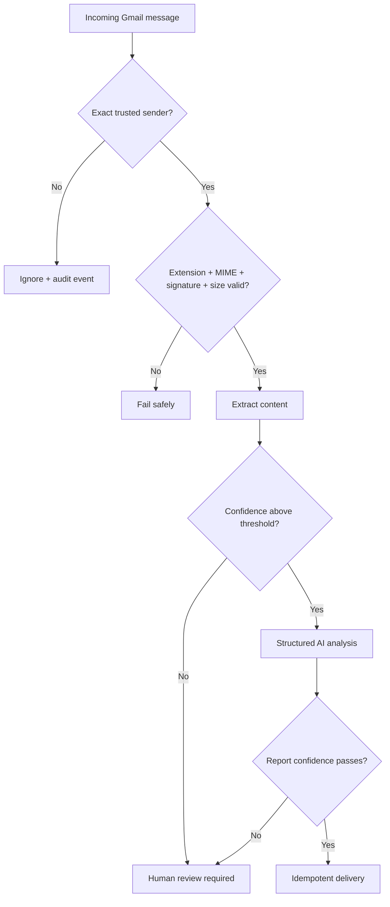

<div align="center">

# TaxSentry

### Financial Sentinel for Vietnamese business and tax-reporting workflows

**A terminal-first AI agent that turns trusted financial documents into structured analysis, reviewable evidence, and PDF reports.**

[](https://www.npmjs.com/package/taxsentry)
[](https://github.com/thienan230427/TaxSentry/actions/workflows/cross-platform.yml)
[](https://www.python.org/)
[](https://nodejs.org/)
[](LICENSE)

[Quick start](#quick-start) · [How it works](#how-it-works) · [Setup](#interactive-setup) · [Command reference](#command-reference) · [Troubleshooting](#troubleshooting)

</div>

> [!IMPORTANT]
> TaxSentry assists with analysis; it does not file taxes or make financial, legal, or operational decisions. A qualified person must review every material conclusion before acting on it.

## At a glance

| Input | Trust and extraction | Intelligence | Output |
| --- | --- | --- | --- |
| Terminal chat | Authorized AI provider | Shared conversational session | Streaming terminal response |
| Gmail attachments | Sender allowlist, MIME and magic-byte validation, SHA-256 | Structured financial analysis | PDF report by Gmail and Telegram |
| XLSX | Financial workbook parser | Confidence-aware report schema | Evidence, risks, recommendations |
| PDF, PNG, JPG | Text extraction or Tesseract OCR | Human-review gate when confidence is low | Auditable SQLite job history |

TaxSentry is designed as a **single-organization internal assistant**. It combines a responsive terminal cockpit with an optional Gmail processing worker and Telegram gateway in one process.

## How it works



### Core capabilities

- **Terminal-first UX** — streaming chat, command completion, session history, job controls, Gmail status, and Telegram status in one cockpit.
- **Trusted inbox automation** — only exact addresses in `gmail.trusted_senders` enter the processing pipeline.
- **Defensive attachment handling** — extension, MIME type, file signature, size, archive structure, path, and SHA-256 checks happen before parsing.
- **Multi-format extraction** — native XLSX parsing, direct PDF text extraction, and Tesseract OCR for scanned PDFs and images.
- **Two AI provider paths** — local LM Studio or the official Codex App Server with its own isolated authentication directory.
- **Structured reporting** — the model must return a fixed business-report schema containing evidence, missing data, confidence, risks, and recommendations.
- **Human-in-the-loop control** — weak OCR or analysis moves a job to `needs_review`; `/approve` is required before it can continue.
- **Reliable delivery** — retries use exponential backoff, interrupted jobs recover, and stable identifiers prevent duplicate email delivery.
- **Secret isolation** — Gmail App Passwords and Telegram tokens stay in the operating-system keyring, not `config.json`.
- **Cross-platform validation** — CI covers Windows, macOS, and Ubuntu with Python 3.11–3.13 and Node.js 24.

## Quick start

The npm package is the shortest installation path. It ships the matching Python wheel and creates an isolated runtime under `~/.taxsentry/runtime/venv` on first use.

### 1. Install prerequisites

- [Node.js 22 or later](https://nodejs.org/)
- [uv](https://docs.astral.sh/uv/getting-started/installation/)
- Python 3.11, 3.12, or 3.13 available to `uv`

Tesseract is needed only for Gmail profiles that process scans or images.

### 2. Install and configure

```powershell
npm install -g taxsentry
taxsentry setup
taxsentry doctor
taxsentry
```

### 3. Choose the right profile

| Profile | Terminal AI | Gmail workflow | Telegram gateway | Best for |
| --- | :---: | :---: | :---: | --- |
| **Chat Only** | Yes | No | No | Local analysis and terminal conversations |
| **Email Agent** | Yes | Yes | No | Automated inbox-to-report processing |
| **Full Agent** | Yes | Yes | Yes | Inbox automation plus mobile status and approvals |



## Requirements

| Component | Required when | Notes |
| --- | --- | --- |
| Python `>=3.11,<3.14` | Always | The npm launcher asks `uv` to create a compatible isolated runtime. |
| Node.js `>=22` | npm installation | Not required for a direct Python installation. |
| `uv` | npm runtime, source install, updates | Creates the runtime, installs the wheel, and manages Python dependencies. |
| Tesseract + `vie` and `eng` | Scanned PDF/image processing | `taxsentry doctor --fix` can attempt installation with the native package manager. |
| Google App Password | Email Agent / Full Agent | Requires Google 2-Step Verification; OAuth client files are not used. |
| LM Studio or Codex CLI | Always | Select one provider during setup. |
| Telegram bot token | Full Agent | Only configured chat IDs are authorized. |

### Tesseract installation

<details>
<summary><strong>Windows</strong></summary>

```powershell
winget install --id UB-Mannheim.TesseractOCR --exact
```

Chocolatey alternative:

```powershell
choco install tesseract -y
```

</details>

<details>
<summary><strong>macOS</strong></summary>

```bash
brew install tesseract tesseract-lang
```

</details>

<details>
<summary><strong>Ubuntu / Debian</strong></summary>

```bash
sudo apt update
sudo apt install tesseract-ocr tesseract-ocr-vie
```

</details>

## Installation options

### npm — recommended for end users

```powershell
npm install -g taxsentry
taxsentry --version
taxsentry setup
```

The TypeScript launcher handles `--help` and `--version` immediately. Other commands are forwarded to the bundled Python core. Application upgrades replace the managed runtime while preserving user data in `~/.taxsentry`.

### uv tool — direct Python installation

```powershell
uv tool install git+https://github.com/thienan230427/TaxSentry.git
taxsentry setup
taxsentry doctor
```

### Source checkout — development

```powershell
git clone https://github.com/thienan230427/TaxSentry.git
cd TaxSentry
uv sync --locked --extra dev
uv run taxsentry setup
```

When TaxSentry detects a v1 profile, it moves that profile to a timestamped backup directory before creating the v2 profile. It does not delete the old data.

## Interactive setup

Run:

```powershell
taxsentry setup
```

The bilingual inline wizard supports number keys, arrow keys, Enter, Esc, and Ctrl+C.



Setup is transactional:

1. Choose **Full Agent**, **Email Agent**, or **Chat Only**.
2. Select **Codex / ChatGPT** or **LM Studio**.
3. Authenticate and choose a discovered model.
4. Configure only the integrations enabled by the selected profile.
5. Review the summary and choose **Save & Authenticate**, **Back**, or **Cancel**.
6. Provider, Gmail, and Telegram checks finish before new configuration and secrets replace the previous profile.

Cancelling or failing validation leaves the existing profile unchanged.

### Provider setup

| Provider | Connection | Model selection | Authentication |
| --- | --- | --- | --- |
| **LM Studio** | OpenAI-compatible URL, default `http://127.0.0.1:1234/v1` | Discovered from `/models`, with manual fallback | Local endpoint |
| **Codex App Server** | Official `codex app-server` JSONL protocol | Read from the authenticated account | Browser OAuth or device code |

Codex uses an isolated home directory under `~/.taxsentry/codex`. This keeps TaxSentry's session separate from the login used by the Codex CLI, desktop app, or editor extensions. TaxSentry does not write OAuth tokens or login URLs to `config.json`.

### Gmail setup

1. Enable Google 2-Step Verification.
2. Create a 16-character [Google App Password](https://myaccount.google.com/apppasswords).
3. Enter the Gmail inbox, exact trusted sender addresses, director email, and polling interval.
4. Paste the App Password when prompted; it is validated before being stored in the OS keyring.

### Telegram setup

1. Create a bot with [BotFather](https://t.me/BotFather).
2. Enter one or more numeric chat IDs.
3. Paste the token when prompted; TaxSentry calls Telegram to verify the bot before saving it.

## Financial Sentinel TUI

Run `taxsentry` without a subcommand:

```text
╭────────────── TAXSENTRY · FINANCIAL SENTINEL · v2.0.7 ──────────────╮
│ ╔╦╗╔═╗═╗ ╦╔═╗╔═╗╔╗╔╔╦╗╦═╗╦ ╦     ◆ Agent      READY              │
│  ║ ╠═╣╔╩╦╝╚═╗║╣ ║║║ ║ ╠╦╝╚╦╝     ◇ Provider   codex / model       │
│  ╩ ╩ ╩╩ ╚═╚═╝╚═╝╝╚╝ ╩ ╩╚═ ╩      ● Gmail      polling 60s         │
│ Trợ lý tài chính và cảnh báo thuế Việt Nam       ● Telegram ON      │
╰──────────────────────────────────────────────────────────────────────╯
  Boss > _
```

The TUI starts the enabled background services and shuts them down cleanly when it exits. Terminal and authorized Telegram messages share the same serialized chat service and persistent session history.

### Cockpit commands

| Command | Action |
| --- | --- |
| `/help` | Show all cockpit commands. |
| `/status` | Show provider, Gmail, Telegram, sender count, and configuration path. |
| `/jobs` | Show recent job IDs, states, subjects, and retry counts. |
| `/report` | Show the latest report executive summary. |
| `/retry [job-prefix]` | Requeue a failed or review-pending job; defaults to the latest matching job. |
| `/approve [job-prefix]` | Approve and requeue a `needs_review` job. |
| `/new` | Start a new conversational session. |
| `/exit` | Stop background services and close the cockpit. |

## Command reference

| Command | Purpose |
| --- | --- |
| `taxsentry` | Configure on first run, then open the Financial Sentinel TUI. |
| `taxsentry --help` | Show public CLI commands. |
| `taxsentry --version` | Print the installed version. |
| `taxsentry setup` | Create or update the local profile. |
| `taxsentry doctor` | Validate the provider and all enabled integrations. |
| `taxsentry doctor --fix` | Create runtime directories and attempt to install missing Tesseract components. |
| `taxsentry update` | Update through the stable channel for the detected installation type. |
| `taxsentry update --main` | Explicitly update the Python core from GitHub `main`. |

## Document-processing lifecycle



### Processing rules

1. Gmail searches for messages with attachments that do not have the `TaxSentry/Completed` label.
2. Messages from addresses outside the exact trusted-sender allowlist are ignored and recorded as events.
3. Each Gmail message ID creates at most one job.
4. Attachments are validated, stored by job, and extracted.
5. Low OCR confidence moves the job to `needs_review` before any AI analysis.
6. The AI provider returns a fixed JSON report schema.
7. Low report confidence moves the job to `needs_review` before rendering or delivery.
8. Approved reports are rendered to PDF and delivered idempotently.
9. Gmail labels reflect `Processing`, `NeedsReview`, `Completed`, or `Failed` state.

### Supported documents

| Extension | Validation | Extraction path |
| --- | --- | --- |
| `.xlsx` | ZIP structure, required workbook members, expanded-size limit | Native financial workbook parser |
| `.pdf` | `%PDF-` signature | Direct text when sufficient; otherwise page OCR |
| `.png` | PNG magic bytes | Tesseract OCR |
| `.jpg`, `.jpeg` | JPEG magic bytes | Tesseract OCR |

The default maximum attachment size is 25 MB. XLSX archive expansion is also bounded to reduce malformed archive risk.

## Telegram control

Only IDs in `director.telegram_chat_ids` are authorized. Unknown chats receive no workflow data.

| Command | Result |
| --- | --- |
| `/status`, `/jobs` | List recent jobs and their current states. |
| `/report` | Send the latest generated PDF. |
| `/retry <job-prefix>` | Requeue a failed or review-pending job. |
| `/approve <job-prefix>` | Approve a `needs_review` job. |
| Plain text | Ask the same assistant used by the terminal session. |

## Configuration and local data

TaxSentry stores its complete profile under `~/.taxsentry` by default.

```text
~/.taxsentry/
├── config.json                 # non-secret configuration
├── taxsentry.db                # jobs, reports, deliveries, events, chat history
├── logs/                       # reserved runtime log directory
├── run/                        # worker lock and runtime files
├── downloads/<job-id>/         # validated attachments and generated reports
├── runtime/
│   ├── installed-version       # npm runtime version sentinel
│   └── venv/                   # isolated Python environment
└── codex/                      # isolated Codex App Server home
```

### Important configuration keys

| Key | Default | Purpose |
| --- | --- | --- |
| `provider.kind` | `lmstudio` | `lmstudio` or `codex` |
| `provider.model` | empty | Model selected during setup |
| `gmail.enabled` | `true` | Enable the Gmail worker |
| `gmail.account` | empty | Gmail inbox used by IMAP and SMTP |
| `gmail.trusted_senders` | `[]` | Exact sender allowlist |
| `director.email` | empty | Recipient of generated PDF reports |
| `director.telegram_chat_ids` | `[]` | Authorized Telegram recipients and operators |
| `worker.poll_seconds` | `60` | Gmail polling interval |
| `worker.max_retries` | `3` | Maximum attempts with exponential backoff |
| `worker.max_attachment_mb` | `25` | Per-attachment size limit |
| `ocr.minimum_confidence` | `70` | OCR percentage required before analysis |
| `report.minimum_confidence` | `0.70` | Report confidence required before delivery |

### Environment overrides

| Variable | Effect |
| --- | --- |
| `TAXSENTRY_HOME` | Move the complete TaxSentry profile. |
| `TAXSENTRY_CONFIG_FILE` | Override only the configuration file path. |
| `TAXSENTRY_MEMORY_DB` | Override only the SQLite database path. |
| `TAXSENTRY_UV` | Point the npm launcher to a specific `uv` executable. |

## Security model



- Sender allowlisting is a mandatory trust boundary.
- File content must match its extension and MIME type before parsing.
- Secrets are stored in the OS keyring and removed from persisted JSON.
- Stable Gmail message IDs and delivery records prevent duplicate work.
- SQLite records job state, events, reports, approvals, and delivery outcomes.
- Review approval is consumed after successful delivery and cannot silently authorize later jobs.
- The updater never stashes, resets, or overwrites local Git changes.

Never commit App Passwords, bot tokens, OAuth data, `.env` files, databases, downloaded attachments, or generated reports.

## Updating TaxSentry

```powershell
taxsentry update
taxsentry update --main
```

| Installation | Stable update | `--main` behavior |
| --- | --- | --- |
| Git clone | Fast-forward current upstream, then `uv sync --locked` | Requires branch `main`; fast-forwards `origin/main` |
| npm global | Checks npm and installs only a newer stable version | Reinstalls the managed Python core from GitHub `main` |
| uv tool | `uv tool upgrade taxsentry-agent` | Reinstalls from GitHub `main` |

Git updates require a clean working tree. TaxSentry refuses to reset or overwrite local edits. Restart the TUI after updating.

## Troubleshooting

Start with:

```powershell
taxsentry doctor
taxsentry doctor --fix
```

| Symptom | Likely cause | Fix |
| --- | --- | --- |
| `uv` not found | npm launcher cannot create its Python runtime | Install `uv`, reopen the terminal, or set `TAXSENTRY_UV` to the executable. |
| No compatible Python found | Python is outside `>=3.11,<3.14` | Install Python 3.11–3.13 and rerun TaxSentry. |
| Gmail rejects the password | Normal password used, App Password invalid, or 2-Step Verification disabled | Enable 2-Step Verification, create a fresh 16-character App Password, rerun `taxsentry setup`. |
| Trusted messages are ignored | Sender address does not exactly match the allowlist | Check `/status`, then rerun setup with the normalized sender address. |
| OCR reports missing languages | `vie` or `eng` data is absent | Install the language packs and rerun `taxsentry doctor`. |
| LM Studio health check fails | Server stopped, URL wrong, or no model available | Start the local server, verify `/v1/models`, then rerun setup. |
| Codex login cannot open a browser | Browser launch blocked | Use the device-code option shown by setup. |
| Telegram commands do nothing | Chat ID is not authorized | Add the numeric chat ID through `taxsentry setup`. |
| Job stays in `needs_review` | OCR or analysis confidence is below threshold | Inspect the source and use `/approve <job-prefix>` only after human review. |
| Git update refuses to run | Working tree contains edits or branch lacks an upstream | Commit/stash manually or configure the upstream; TaxSentry will not do it automatically. |
| npm publish fails with Windows `EPERM` | Default npm cache is inaccessible | Use `npm publish --cache D:\TaxSentry\.npm-cache`. |
| pytest cannot use the Windows temp folder | Default temp ACL blocks test creation | Use the workspace-local `--basetemp` command below. |

## Development

### Python checks

```powershell
uv sync --locked --extra dev
uv lock --check
uv run ruff check src tests
uv run pytest -q
uv build
```

Windows fallback for restricted temporary folders:

```powershell
$env:TAXSENTRY_HOME='D:\TaxSentry\tmp-test-home'
$env:UV_CACHE_DIR='D:\TaxSentry\.uv-cache'
uv run pytest -q --basetemp=D:\TaxSentry\tmp-pytest -p no:cacheprovider
```

### npm launcher checks

```powershell
cd npm
npm ci
npm run typecheck
npm test
npm pack --dry-run --cache D:\TaxSentry\.npm-cache
npm run smoke
```

The smoke test packs the npm artifact, confirms that exactly one Python wheel is bundled, installs it in an isolated prefix, creates the managed Python runtime, and runs the installed launcher.

### Release checklist

All five version locations must match:

- `npm/package.json`
- `npm/package-lock.json` at the package and root-package entries
- `pyproject.toml`
- `src/taxsentry/__init__.py`
- `uv.lock`

Then validate the real package contents before publishing:

```powershell
cd D:\TaxSentry\npm
npm publish --dry-run --cache D:\TaxSentry\.npm-cache
npm publish --cache D:\TaxSentry\.npm-cache
```

## Project structure

```text
TaxSentry/
├── .github/workflows/           # cross-platform validation
├── npm/
│   ├── src/                     # TypeScript launcher and runtime bootstrap
│   ├── scripts/                 # prepack and smoke-install checks
│   ├── tests/                   # Node.js runtime tests
│   └── dist/vendor/             # bundled Python wheel
├── src/taxsentry/
│   ├── bot/                     # Telegram command gateway
│   ├── core/                    # XLSX parser and PDF generator
│   ├── knowledge_base/          # Vietnamese tax knowledge context
│   ├── cockpit.py               # terminal interface
│   ├── config.py                # profile paths and defaults
│   ├── gmail.py                 # IMAP, SMTP, and attachment validation
│   ├── providers.py             # LM Studio and Codex App Server
│   ├── setup_wizard.py          # bilingual transactional setup
│   ├── store.py                 # SQLite jobs, reports, events, and sessions
│   ├── updater.py               # safe update channels
│   └── workflow.py              # document-processing orchestration
├── tests/                       # Python unit and regression tests
├── stress_tests/                # representative spreadsheet fixtures
├── pyproject.toml               # Python package metadata
└── uv.lock                      # reproducible Python dependency lock
```

## Production checklist

- [ ] Run `taxsentry doctor` on the target machine.
- [ ] Confirm the selected model and provider health.
- [ ] Verify Gmail IMAP/SMTP with the production App Password.
- [ ] Review every trusted sender address.
- [ ] Confirm Telegram chat IDs and bot ownership.
- [ ] Verify Tesseract `vie` and `eng` language packs.
- [ ] Process one representative document end to end.
- [ ] Review the generated PDF against the source evidence.
- [ ] Test a low-confidence document and the `/approve` flow.
- [ ] Back up `~/.taxsentry` according to the organization's retention policy.

## License

TaxSentry is released under the [MIT License](LICENSE).

---

<div align="center">

**TaxSentry 2.0.7 — evidence first, human approval where it matters.**

</div>
