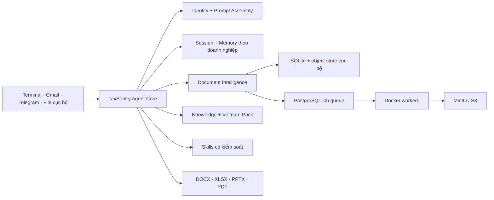
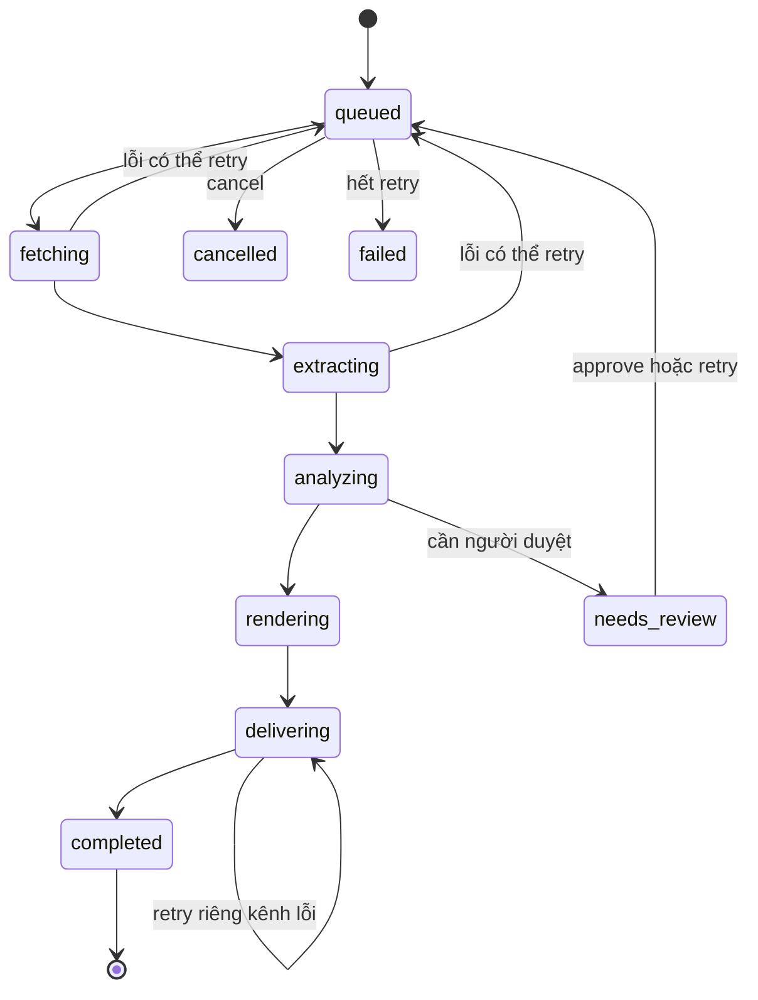

<div align="center">

# TaxSentry 3

### AI Agent phân tích tài chính, thuế và hồ sơ doanh nghiệp

**Đọc hồ sơ nhiều định dạng · Bộ nhớ theo doanh nghiệp · Tri thức có kiểm chứng · Xuất DOCX/XLSX/PPTX/PDF · Terminal, Gmail và Telegram**

[](https://github.com/thienan230427/TaxSentry/actions/workflows/cross-platform.yml)
[](https://www.python.org/)
[](https://nodejs.org/)
[](https://www.npmjs.com/package/taxsentry)
[](LICENSE)

[Bắt đầu nhanh](#bắt-đầu-nhanh) · [Chức năng](#toàn-bộ-chức-năng) · [Lệnh](#hướng-dẫn-sử-dụng-agent) · [Tài liệu](#đọc-và-phân-tích-tài-liệu) · [Triển khai](#triển-khai-phân-tán) · [Xử lý lỗi](#xử-lý-sự-cố)

</div>

> [!IMPORTANT]
> TaxSentry hỗ trợ trích xuất, phân tích và lập báo cáo; hệ thống không tự nộp
> hồ sơ thuế và không thay người có thẩm quyền đưa ra quyết định tài chính,
> pháp lý hay vận hành. Mọi kết luận trọng yếu phải được đối chiếu với chứng từ
> gốc và nguồn chính thức trước khi sử dụng.

> [!NOTE]
> Mã nguồn trên nhánh `main` hiện mang phiên bản **3.0.0**. Gói npm `latest`
> vẫn là **2.0.13** cho đến khi quy trình phát hành v3 hoàn tất. Muốn dùng các
> tính năng v3 ngay, hãy [cài từ mã nguồn](#cài-taxsentry-30-từ-mã-nguồn).

## TaxSentry là gì?

TaxSentry là một AI agent chạy ưu tiên trên terminal, được thiết kế cho hồ sơ
tài chính và thuế của doanh nghiệp Việt Nam. Agent dùng chung một lõi hội thoại
cho Terminal, Telegram và Gmail; có thể ghi nhớ theo từng doanh nghiệp, đọc
nhiều file trong cùng một hồ sơ, lập bằng chứng đến đúng vị trí nguồn và tạo
báo cáo ở nhiều định dạng.


```mermaid
flowchart LR
    Inputs["Terminal · Gmail · Telegram · File cục bộ"] --> Core["TaxSentry Agent Core"]
    Core --> Prompt["Identity + Prompt Assembly"]
    Core --> Memory["Session + Memory theo doanh nghiệp"]
    Core --> Docs["Document Intelligence"]
    Core --> Knowledge["Knowledge + Vietnam Pack"]
    Core --> Skills["Skills có kiểm soát"]
    Core --> Artifacts["DOCX · XLSX · PPTX · PDF"]
    Docs --> Local["SQLite + object store cục bộ"]
    Docs --> Queue["PostgreSQL job queue"]
    Queue --> Workers["Docker workers"]
    Workers --> Objects["MinIO / S3"]
```

## Toàn bộ chức năng

### 1. Agent dùng chung trên nhiều kênh

- Giao diện terminal xây dựng bằng Textual, có streaming và gợi ý slash command.
- Terminal và Telegram dùng chung `ChatService`, session, memory và company
  context.
- Gmail có thể được tìm kiếm thủ công hoặc theo dõi tự động để xử lý file đính
  kèm mới.
- Có lịch sử hội thoại, tìm session, mở session mới và khôi phục session cũ.
- Hủy tác vụ đang chạy và đóng các dịch vụ nền an toàn.
- Giao diện hỗ trợ tiếng Việt và tiếng Anh.

### 2. Identity và bộ nhớ đa tầng

Prompt của agent được ghép theo lớp từ:

1. quy tắc an toàn bắt buộc;
2. `SOUL.md` — danh tính, tính cách và cách giao tiếp;
3. hướng dẫn công cụ và chỉ mục skill;
4. `AGENTS.md` — quy ước của repository;
5. `USER.md` và `COMPANY.md`;
6. memory đã tuyển chọn;
7. summary và ngữ cảnh liên quan của session;
8. nội dung file, email hoặc nguồn ngoài trong vùng dữ liệu không tin cậy.

Các khả năng bộ nhớ:

- tự động lưu toàn bộ lượt hội thoại;
- cô lập session và memory bằng `company_id`;
- tìm kiếm session theo từ khóa;
- nén context ở ngưỡng mềm 55% và ngưỡng cứng 80%;
- snapshot prompt cố định trong một session để giảm trôi tính cách;
- `/agent reload` để nạp lại identity, memory và skill;
- `/forget` xóa nội dung memory và giữ tombstone kiểm toán không chứa payload;
- từ chối ghi secret hoặc nội dung không đáng tin thành memory đã xác nhận;
- thời hạn mặc định 90 ngày cho dữ liệu không được pin.

### 3. Document Intelligence

TaxSentry kiểm tra magic bytes, MIME, cấu trúc archive và kích thước trước khi
đọc. Mỗi tài liệu có manifest, danh sách unit, trạng thái xử lý và coverage.
Nếu một sheet, trang, slide hay section lỗi, báo cáo phải chỉ rõ unit đó thay vì
ngầm cắt bỏ.

| Định dạng | Nội dung được đọc |
| --- | --- |
| `.xlsx`, `.xlsm` | Tất cả sheet, kể cả hidden/very-hidden; dữ liệu theo dòng; công thức và cached value; merged cells; defined names; nguồn chart; external-link inventory; dependency công thức |
| `.xls` | Xác thực compound file, sau đó chuyển đổi bằng LibreOffice sandbox |
| `.docx` | Paragraph, heading/section, table, header/footer, footnote/endnote, comment, tracked-change text và OCR ảnh nhúng |
| `.doc` | Xác thực compound file, sau đó chuyển đổi bằng LibreOffice sandbox |
| `.pptx` | Slide, shape, table, chart series, speaker notes, comment, theme/master metadata và OCR ảnh nhúng |
| `.ppt` | Xác thực compound file, sau đó chuyển đổi bằng LibreOffice sandbox |
| `.pdf` | Xử lý từng trang; đọc text trực tiếp và chỉ OCR các trang thiếu text |
| `.png`, `.jpg`, `.jpeg` | Xác thực chữ ký file và OCR bằng Tesseract |

Giới hạn và nguyên tắc:

- tối đa 500 MB cho một file và 500 MB tổng một case;
- một case có thể gồm nhiều file, giữ riêng nguồn và cảnh báo số liệu mâu thuẫn;
- Open XML tối đa 4 GiB sau giải nén, 100.000 entry và tỷ lệ nén 1.000:1;
- không thực thi macro;
- không mở external link;
- `.docm` và `.pptm` không được chấp nhận;
- file Office cũ cần LibreOffice và đường chạy sandbox;
- nội dung tài liệu luôn được coi là dữ liệu không tin cậy, không phải chỉ dẫn
  cho agent.

Fixture acceptance đã ghi nhận case tổng 498 MiB gồm 100 sheet Excel/1.000.000
dòng, PDF 1.000 trang, PowerPoint 500 slide và Word dài với coverage
7.609/7.609 unit. Xem
[kết quả benchmark](docs/benchmarks/acceptance-2026-07-27.md).

### 4. Phân tích tài chính và tư vấn có căn cứ

- Chuẩn hóa doanh thu, chi phí, lợi nhuận, dòng tiền và các kỳ báo cáo.
- Ưu tiên cột `Kỳ Này` khi phân tích workbook phù hợp.
- Không lấy doanh thu hoạt động tài chính thay doanh thu chính.
- Tính toán deterministic bằng Python cho tăng trưởng, chênh lệch ngân sách,
  biên lợi nhuận, tỷ lệ chi phí và sensitivity P&L ba kịch bản.
- Phát hiện dữ liệu thiếu, số liệu lặp và số liệu mâu thuẫn giữa nhiều file.
- Mọi numeric claim hoặc legal claim phải có evidence, hoặc được gắn nhãn
  assumption/missing data.
- Báo cáo có executive summary, findings, scenarios, tax risks, actions,
  sources, assumptions và confidence.
- Báo cáo có tác động trọng yếu, độ tin cậy thấp, rủi ro thuế cao hoặc nguồn
  pháp lý cũ được giữ ở trạng thái chờ duyệt.

### 5. Tri thức và jurisdiction pack

- Có Vietnam jurisdiction pack với metadata về phiên bản, ngày hiệu lực, nguồn
  và quy tắc citation.
- Tra cứu kết hợp exact reference, full-text, độ tương đồng, độ tin cậy, độ mới
  và jurisdiction.
- Chỉ dùng nguồn pháp lý đã xác minh cho kết luận thuế/pháp lý.
- Có kiểm tra độ mới của nguồn và lệnh refresh.
- Quốc gia chưa có pack đã xác minh chỉ được phân tích tài chính; phần pháp
  lý/thuế phải báo `missing_knowledge`, không suy đoán từ kiến thức chung của
  model.

### 6. Tạo báo cáo nhiều định dạng

Model tạo dữ liệu báo cáo có cấu trúc; renderer Python tạo file theo cách
deterministic. Bốn định dạng dùng chung số liệu, kỳ, currency và evidence graph.

| Đầu ra | Chức năng chính |
| --- | --- |
| DOCX | Executive/technical sections, style, bảng, biểu đồ, caption, bookmark, TOC và nguồn |
| XLSX | Source sheet, assumption có thể sửa, công thức do ứng dụng tạo, sensitivity matrix, risk/action và native chart |
| PPTX | Executive narrative, native chart, theme/master, speaker notes và source footer |
| PDF | Bản cố định để duyệt/lưu trữ, pagination validation, citation và disclaimer |

Mặc định agent dùng tiếng Việt, VND và ngày `dd/mm/yyyy`. Có thể yêu cầu tiếng
Anh, song ngữ hoặc template DOCX/XLSX/PPTX riêng. Kết quả `/create` được lưu
trong `~/.taxsentry/outputs`.

### 7. Gmail Agent

- Tìm Gmail bằng ngôn ngữ tự nhiên hoặc cú pháp Gmail.
- Đọc nội dung và tên attachment của một email.
- Theo dõi mọi người gửi, không dùng trusted-sender allowlist.
- Chỉ tự động xử lý email mới hơn mốc UID được ghi lúc setup.
- Email cũ phải được tìm và xác nhận thủ công trước khi xử lý.
- Đọc All Mail, Spam và Trash khi mailbox có hỗ trợ; loại Sent và Drafts khỏi
  luồng đầu vào.
- Nhãn workflow: `Processing`, `Completed`, `NeedsReview`, `Failed`.
- Job ID ổn định theo email và SHA-256 của attachment để chống xử lý trùng.
- Retry theo từng kênh: Gmail thành công nhưng Telegram lỗi thì chỉ gửi lại
  Telegram.
- Báo cáo hoàn tất được gửi lại tài khoản Gmail đã kết nối.

### 8. Telegram Agent

- Chỉ chat ID trong `director.telegram_chat_ids` được phép sử dụng bot.
- Plain text dùng cùng agent và memory với terminal.
- Hỗ trợ chat, Gmail search/process, tạo tài liệu, xem job/report, retry,
  approve, cancel, session và memory.
- Có thể gửi tài liệu và report hoàn tất đến các chat đã cấu hình.
- Telegram Bot API giới hạn file document ở 50 MB.

### 9. Skills có kiểm soát

Skill có thể đến từ thư mục local, GitHub commit đã pin hoặc catalog Git.
TaxSentry chỉ nạp tên và mô tả vào prompt; `SKILL.md`, reference, template hoặc
script chỉ được tải khi cần.

Mỗi skill phải có manifest về version, capability, permission, dependency,
source, commit, checksum, signature và phiên bản TaxSentry tối thiểu.

Quy trình an toàn:

1. cài hoặc tạo skill thành draft;
2. validate manifest, path, dependency và script;
3. kiểm tra checksum/commit;
4. chạy script trong container sandbox khi được phép;
5. chờ người dùng approve;
6. mới enable version đã duyệt;
7. có thể rollback hoặc disable.

Script skill không có network mặc định. Quyền filesystem, process, domain mạng
và external send phải được khai báo; quyền mới hoặc gửi ra ngoài luôn cần duyệt.

### 10. Data plane phân tán

Khi `data_plane.enabled=false`, agent dùng SQLite và object store cục bộ. Khi
bật distributed mode:

- PostgreSQL + `pgvector`/`pg_trgm` lưu state và job;
- queue dùng lease, heartbeat, checkpoint, retry, cancel và resume;
- nhiều Docker worker có thể nhận job qua `FOR UPDATE SKIP LOCKED`;
- MinIO/S3 lưu raw document, unit payload và artifact;
- Gmail workflow và Artifact Service vẫn gọi cùng một `DocumentService`.

`deploy/compose.yml` chỉ dành cho phát triển local vì dùng PostgreSQL không TLS,
MinIO HTTP và credential phát triển. Production phải dùng cấu hình bảo mật tại
[`deploy/PRODUCTION.md`](deploy/PRODUCTION.md).

## Trạng thái phát hành

| Kênh | Phiên bản | Cách dùng |
| --- | --- | --- |
| GitHub `main` | 3.0.0 | Đầy đủ mã nguồn v3 hiện tại |
| npm `latest` | 2.0.13 | Bản stable công khai hiện tại |

Mã 3.0.0 đã có test unit/integration/security, CI đa nền tảng và fixture file
lớn. Việc này không thay thế rehearsal trên dữ liệu sản xuất: migration/rollback
thực tế, shadow run 2.0.13–3.0, TLS đa máy, backup mã hóa và restore vẫn phải
được tổ chức triển khai xác nhận.

## Bắt đầu nhanh

### Yêu cầu hệ thống

Bắt buộc:

- Windows, macOS hoặc Linux;
- [Node.js 22+](https://nodejs.org/) nếu cài qua npm;
- [uv](https://docs.astral.sh/uv/getting-started/installation/);
- Python 3.11, 3.12 hoặc 3.13;
- Codex CLI/App Server hoặc LM Studio đang chạy.

Tùy nhu cầu:

- Tesseract OCR với language pack `vie` và `eng`;
- LibreOffice cho `.doc`, `.xls`, `.ppt`;
- Gmail App Password cho Email Agent/Full Agent;
- Telegram bot token cho Full Agent;
- Docker, PostgreSQL/pgvector và MinIO cho distributed mode.

### Cài bản stable từ npm

Lệnh này hiện cài TaxSentry 2.0.13:

```powershell
npm install -g taxsentry
taxsentry --version
taxsentry setup
taxsentry doctor
taxsentry
```

TypeScript launcher tự tạo Python virtual environment ở
`~/.taxsentry/runtime/venv`, cài wheel đi kèm và chuyển tiếp lệnh sang Python
core.

### Cài TaxSentry 3.0 từ mã nguồn

```powershell
git clone https://github.com/thienan230427/TaxSentry.git
cd TaxSentry
uv sync --locked --extra dev
uv run taxsentry --version
uv run taxsentry setup
uv run taxsentry doctor
uv run taxsentry
```

Nếu cần PostgreSQL và S3/MinIO:

```powershell
uv sync --locked --extra dev --extra distributed
```

Cài trực tiếp bằng `uv tool`:

```powershell
uv tool install git+https://github.com/thienan230427/TaxSentry.git
taxsentry setup
```

## Thiết lập agent lần đầu

Chạy:

```powershell
taxsentry setup
```

Wizard song ngữ có hai đường:

- **Quick Setup:** chọn provider/model, tắt Gmail và Telegram để chat nhanh.
- **Full Setup:** chọn profile và cấu hình các dịch vụ cần dùng.

| Profile | Terminal | Gmail | Telegram | Phù hợp |
| --- | :---: | :---: | :---: | --- |
| Chat Only | Có | Không | Không | Chat và tạo tài liệu cục bộ |
| Email Agent | Có | Có | Không | Xử lý attachment và gửi report qua Gmail |
| Full Agent | Có | Có | Có | Agent đầy đủ và truy cập từ xa qua Telegram |

Các bước:

1. Chọn ngôn ngữ giao diện.
2. Chọn Quick Setup hoặc Full Setup.
3. Chọn Codex/ChatGPT hoặc LM Studio.
4. Đăng nhập/chọn model.
5. Nếu bật Gmail, nhập email, chu kỳ polling và App Password 16 ký tự.
6. Nếu bật Telegram, nhập bot token và các chat ID được phép.
7. Kiểm tra summary và xác thực dịch vụ.
8. Chỉ sau khi kiểm tra thành công, cấu hình không chứa secret mới được lưu.

Hủy wizard hoặc xác thực thất bại không ghi đè cấu hình đang dùng. Gmail App
Password và Telegram bot token được lưu trong OS keyring, không nằm trong
`config.json`.

### Chuẩn bị Gmail

1. Bật Google 2-Step Verification.
2. Tạo [Google App Password](https://myaccount.google.com/apppasswords).
3. Chạy `taxsentry setup`.
4. Dùng đúng tài khoản Gmail và App Password 16 ký tự.
5. Chạy `taxsentry doctor`.

Tài khoản này được dùng cho IMAP, SMTP và nhận báo cáo. Mốc UID được tạo trong
setup để agent không tự động quét ngược toàn bộ email cũ.

### Chuẩn bị Telegram

1. Tạo bot bằng [BotFather](https://t.me/BotFather).
2. Lấy numeric chat ID được phép dùng bot.
3. Nhập token và danh sách chat ID trong Full Setup.
4. TaxSentry xác thực token trước khi thay secret đang lưu.

## Hướng dẫn sử dụng agent

### Lệnh CLI

| Lệnh | Công dụng |
| --- | --- |
| `taxsentry` | Setup nếu chưa cấu hình, sau đó mở TUI |
| `taxsentry --help` | Hiện lệnh công khai |
| `taxsentry --version` | Hiện phiên bản |
| `taxsentry setup` | Tạo hoặc cập nhật profile |
| `taxsentry status` | Xem provider, Gmail, Telegram, LibreOffice và config |
| `taxsentry doctor` | Kiểm tra provider và tích hợp đang bật |
| `taxsentry doctor --fix` | Tạo thư mục cần thiết và thử cài thành phần Tesseract thiếu |
| `taxsentry update` | Cập nhật theo stable channel của kiểu cài đặt |
| `taxsentry update --main` | Cập nhật Python core trực tiếp từ GitHub `main` |
| `taxsentry migrate-v3` | Backup SQLite v2, tạo schema PostgreSQL, import dữ liệu/object reference và ghi migration report |

Tùy chọn migration:

```powershell
taxsentry migrate-v3 `
  --sqlite "C:\Users\Admin\.taxsentry\taxsentry.db" `
  --backup-dir "D:\TaxSentry-backup" `
  --company-id "company-a"
```

`--backup-dir` phải là thư mục trống. SQLite nguồn không bị xóa.

### Lệnh trong Terminal

Gõ `/` để mở gợi ý; dùng phím mũi tên để chọn, `Tab` để hoàn thành và `Esc` để
đóng.

| Lệnh | Công dụng |
| --- | --- |
| `/help` | Hiện danh sách lệnh và phím tắt |
| `/status` | Xem trạng thái provider/Gmail/Telegram/Office |
| `/gmail` | Liệt kê email gần đây theo truy vấn mặc định |
| `/gmail search <query>` | Tìm tối đa 20 email bằng Gmail search syntax |
| `/gmail read <uid>` | Đọc một email và danh sách attachment |
| `/gmail process <uid\|all>` | Xác nhận xử lý email đã tìm |
| `/create [docx\|xlsx\|pptx\|pdf] <yêu cầu>` | Tạo file hoặc để agent chọn bundle |
| `/profile show` | Xem hồ sơ doanh nghiệp |
| `/profile set <field> <value>` | Cập nhật trường company profile được phép |
| `/knowledge status` | Xem trạng thái và độ mới của nguồn |
| `/knowledge refresh` | Refresh registry nguồn chính thức trong allowlist |
| `/skills list` | Liệt kê skill và trạng thái |
| `/skills install <folder>` | Cài skill local thành draft |
| `/skills github <url> <commit> <sha256>` | Cài skill từ GitHub commit đã pin |
| `/skills draft <manifest.json> <instructions.md>` | Tạo skill draft |
| `/skills approve <name> <version>` | Duyệt và enable skill |
| `/skills rollback <name>` | Quay về version đã duyệt trước |
| `/skills disable <name>` | Tắt skill |
| `/jobs` | Xem job gần đây |
| `/report` | Xem executive summary mới nhất |
| `/cancel <job-prefix>` | Yêu cầu hủy job |
| `/retry [job-prefix]` | Chạy lại job failed/needs-review |
| `/approve [job-prefix]` | Duyệt và gửi draft đã render, không phân tích lại |
| `/new` | Mở session mới |
| `/resume <session-id>` | Khôi phục session của doanh nghiệp hiện tại |
| `/sessions <từ khóa>` | Tìm session/message trong doanh nghiệp hiện tại |
| `/forget <memory-id>` | Xóa một memory của doanh nghiệp hiện tại |
| `/agent reload` | Nạp lại identity, memory, skills và reset provider thread |
| `/exit` | Dừng dịch vụ nền và thoát an toàn |

Ví dụ:

```text
Phân tích rủi ro dòng tiền trong các file báo cáo tháng này
/gmail search has:attachment newer_than:30d
/gmail read 1842
/gmail process 1842
/create pdf Tóm tắt báo cáo tài chính tháng này từ Gmail
/create xlsx Lập dashboard quản trị từ "D:\BaoCao\Thang06.xlsx"
/create pptx Tạo bài trình bày cho ban giám đốc --template "D:\Mau\Board.pptx"
/sessions doanh thu quý 2
/agent reload
```

### Lệnh Telegram

| Lệnh | Công dụng |
| --- | --- |
| `/status`, `/jobs` | Xem job và trạng thái |
| `/report` | Nhận PDF mới nhất |
| `/gmail search <query>` | Tìm email và giữ kết quả chờ xác nhận |
| `/gmail process <uid\|all>` | Xử lý email đã xác nhận |
| `/create [docx\|xlsx\|pptx\|pdf] <yêu cầu>` | Tạo tài liệu |
| `/profile show\|set ...` | Xem/cập nhật company profile |
| `/knowledge status\|refresh` | Xem/refresh nguồn |
| `/retry`, `/approve`, `/cancel` | Điều khiển job |
| `/new`, `/resume`, `/sessions` | Quản lý session dùng chung |
| `/forget <memory-id>` | Xóa memory trong company hiện tại |
| `/agent reload` | Nạp lại prompt snapshot |
| Văn bản thường | Chat với TaxSentry |

## Đọc và phân tích tài liệu

### Một file Excel nhiều sheet

```text
/create xlsx Đọc toàn bộ file "D:\DuLieu\BaoCaoNam.xlsx", kiểm tra tất cả sheet,
kể cả sheet ẩn, đối chiếu doanh thu, chi phí và thuế; tạo workbook báo cáo có
sheet nguồn và citation.
```

Agent sẽ inventory tất cả sheet trước, chia dữ liệu thành unit, trích xuất,
index, map/reduce và tạo coverage. Nếu sheet lỗi hoặc công thức không có cached
value, cảnh báo được đưa vào manifest/report.

### Một case gồm nhiều file

```text
/create pdf Phân tích đồng thời "D:\Case\SoCai.xlsx", "D:\Case\HopDong.docx"
và "D:\Case\HoaDon.pdf"; đối chiếu cùng kỳ, chỉ rõ số liệu mâu thuẫn và dẫn
nguồn theo từng file.
```

Case reducer không dùng file sau để âm thầm ghi đè file trước. Mỗi document giữ
coverage riêng và toàn case chỉ sinh một bundle cuối.

### Chọn định dạng đầu ra

```text
/create docx Viết báo cáo tư vấn chi tiết
/create xlsx Tạo mô hình tài chính có assumptions và sensitivity
/create pptx Tạo bản trình bày cho ban giám đốc
/create pdf Tạo bản duyệt và lưu trữ cố định
```

Nếu không ghi định dạng, agent tự chọn profile phù hợp: CFO brief, tax-risk
memo, cash-flow advisory, performance review hoặc scenario plan.

## Vòng đời xử lý Gmail


```mermaid
stateDiagram-v2
    [*] --> queued
    queued --> fetching
    fetching --> extracting
    extracting --> analyzing
    analyzing --> rendering
    rendering --> delivering
    delivering --> completed
    fetching --> queued: lỗi có thể retry
    extracting --> queued: lỗi có thể retry
    analyzing --> needs_review: cần người duyệt
    delivering --> delivering: retry riêng kênh lỗi
    needs_review --> queued: approve hoặc retry
    queued --> cancelled: cancel
    queued --> failed: hết retry
    completed --> [*]
```

Luồng xử lý:

1. tạo job ID từ email identity và SHA-256 attachment;
2. kiểm tra extension, MIME, signature, archive và size;
3. lưu input hợp lệ vào `~/.taxsentry/downloads/<job-id>/`;
4. trích xuất cấu trúc/OCR và tạo coverage;
5. tính metric deterministic và truy hồi tri thức liên quan;
6. tạo phân tích có schema, bỏ số liệu/benchmark không có căn cứ;
7. render bundle và lưu mọi output path;
8. giữ report trọng yếu/rủi ro/thiếu nguồn ở `NeedsReview`;
9. sau approval, gửi đúng draft đã render;
10. ghi nhận riêng từng kênh thành công để chống gửi trùng;
11. gắn nhãn Gmail cuối cùng.

## Cấu hình và dữ liệu cục bộ

```text
~/.taxsentry/
├── config.json
├── taxsentry.db
├── SOUL.md
├── USER.md
├── MEMORY.md
├── companies/<company-id>/
│   ├── COMPANY.md
│   └── MEMORY.md
├── skills/
├── documents/
├── objects/
├── logs/
├── run/
├── downloads/<job-id>/
├── outputs/
├── runtime/
│   ├── installed-version
│   └── venv/
└── codex/
```

Các setting quan trọng trong `config.json`:

| Key | Mặc định | Ý nghĩa |
| --- | --- | --- |
| `ui.language` | `vi` | Ngôn ngữ `vi` hoặc `en` |
| `provider.kind` | `lmstudio` | `lmstudio` hoặc `codex` |
| `provider.model` | rỗng | Model; rỗng để provider chọn |
| `gmail.enabled` | `true` | Bật Gmail search/worker |
| `gmail.process_after_uids` | `{}` | Mốc xử lý tự động theo mailbox |
| `telegram.enabled` | `false` | Bật Telegram |
| `director.telegram_chat_ids` | `[]` | Chat được phép |
| `worker.poll_seconds` | `30` | Chu kỳ polling Gmail |
| `worker.max_retries` | `3` | Số retry |
| `worker.max_attachment_mb` | `500` | Giới hạn một attachment |
| `documents.max_case_mb` | `500` | Giới hạn tổng case |
| `documents.excel_rows_per_unit` | `250` | Số dòng Excel mỗi unit |
| `memory.retention_days` | `90` | Thời hạn dữ liệu không pin |
| `memory.soft_context_ratio` | `0.55` | Ngưỡng nén mềm |
| `memory.hard_context_ratio` | `0.80` | Ngưỡng nén cứng |
| `data_plane.enabled` | `false` | Bật distributed mode |
| `data_plane.postgres_dsn` | rỗng | PostgreSQL DSN |
| `data_plane.object_store.kind` | `local` | `local` hoặc S3/MinIO |
| `ocr.languages` | `vie`, `eng` | Language pack Tesseract |
| `artifacts.output_dir` | `~/.taxsentry/outputs` | Thư mục output |
| `advisor.company.materiality_ratio` | `0.05` | Ngưỡng tác động trọng yếu |

Biến môi trường:

| Biến | Công dụng |
| --- | --- |
| `TAXSENTRY_HOME` | Đổi toàn bộ profile path |
| `TAXSENTRY_CONFIG_FILE` | Đổi đường dẫn config |
| `TAXSENTRY_MEMORY_DB` | Đổi SQLite database |
| `TAXSENTRY_AGENTS_FILE` | Đổi `AGENTS.md` dùng cho prompt |
| `TAXSENTRY_POSTGRES_DSN` | PostgreSQL DSN cho distributed mode |
| `TAXSENTRY_JOB_HANDLER` | Worker handler `module:function` |
| `TAXSENTRY_S3_ENDPOINT` | S3/MinIO endpoint |
| `TAXSENTRY_S3_BUCKET` | Object bucket |
| `TAXSENTRY_S3_ACCESS_KEY` | Service access key |
| `TAXSENTRY_S3_SECRET_KEY` | Service secret key |
| `TAXSENTRY_S3_ALLOW_INSECURE` | Cho phép HTTP, chỉ dùng local development |
| `TAXSENTRY_S3_ENCRYPTION` | S3 server-side encryption mode |
| `TAXSENTRY_UV` | Chỉ định executable `uv` |
| `CODEX_CLI_PATH` | Chỉ định Codex executable |

## Triển khai phân tán

### Local development

`deploy/compose.yml` khởi chạy PostgreSQL/pgvector, MinIO và worker để phát
triển. Không mở topology này ra mạng.

```powershell
docker compose -f deploy/compose.yml up --build
```

### Production

Dùng `deploy/compose.production.json` và làm theo
[`deploy/PRODUCTION.md`](deploy/PRODUCTION.md). Tối thiểu phải có:

- PostgreSQL TLS `verify-full`;
- MinIO/S3 HTTPS;
- credential worker có phạm vi hẹp, không dùng root key;
- Docker secrets/keyring, không nhúng secret vào config/image;
- volume và backup được mã hóa;
- firewall, private network và worker egress control;
- worker image đã pin digest và cùng version trên mọi máy;
- giới hạn CPU/RAM/PID/temp/time;
- telemetry cho queue, lease, retry, coverage, audit và delivery;
- backup và restore rehearsal đã kiểm chứng.

Chi tiết schema, API, migration và rollback:
[`docs/taxsentry-3.md`](docs/taxsentry-3.md).

## Bảo mật và độ tin cậy

- Secret nằm trong OS keyring hoặc Docker secrets, không nằm trong JSON.
- Attachment phải khớp extension, MIME và binary signature.
- Chặn path traversal, corrupt archive, ZIP/XML bomb và MIME spoof.
- Không thực thi macro, external link hoặc chỉ dẫn trong tài liệu.
- Memory từ file/email không được nâng thành dữ liệu tin cậy khi chưa xác nhận.
- Session, memory, document và job được giới hạn theo doanh nghiệp.
- Idempotency chống xử lý và gửi trùng.
- Delivery thành công được ghi theo từng kênh.
- Mỗi stage có timeout; job hỗ trợ retry, cancel, checkpoint và resume.
- Git updater không reset, stash hoặc ghi đè working tree bẩn.
- Report phải nêu nguồn, assumption, missing data và confidence.

Không commit App Password, bot token, OAuth data, `.env`, database, attachment,
report, thư mục runtime hoặc secret triển khai.

## Cập nhật

```powershell
taxsentry update
taxsentry update --main
```

| Kiểu cài | `update` | `update --main` |
| --- | --- | --- |
| Git clone | Fast-forward upstream và `uv sync --locked` | Chỉ khi đang ở `main`, fast-forward `origin/main` |
| npm global | Cài `taxsentry@latest` nếu registry có bản mới | Cài lại Python core từ GitHub `main` |
| uv tool | `uv tool upgrade taxsentry-agent` | Force-install package từ GitHub `main` |

Git update yêu cầu working tree sạch và không tự đổi branch.

## Xử lý sự cố

Chạy ba lệnh đầu tiên:

```powershell
taxsentry status
taxsentry doctor
taxsentry doctor --fix
```

| Lỗi | Nguyên nhân thường gặp | Cách sửa |
| --- | --- | --- |
| Không tìm thấy `uv` | npm launcher không tạo được Python runtime | Cài `uv`, mở terminal mới hoặc đặt `TAXSENTRY_UV` |
| Không có Python phù hợp | Thiếu Python `>=3.11,<3.14` | Cài Python 3.11/3.12/3.13 |
| Gmail từ chối mật khẩu | Dùng password thường hoặc App Password sai | Bật 2-Step Verification, tạo App Password mới và setup lại |
| Gmail không xử lý mail cũ | Agent chỉ tự động xử lý sau setup marker | Dùng `/gmail search`, kiểm tra rồi `/gmail process` |
| OCR thiếu tiếng Việt | Thiếu Tesseract hoặc pack `vie`/`eng` | Cài pack hoặc chạy `taxsentry doctor --fix` |
| `.doc/.xls/.ppt` lỗi | Thiếu LibreOffice/sandbox conversion | Cài LibreOffice, kiểm tra `soffice` trong `PATH` |
| LM Studio lỗi | Server dừng, URL sai hoặc chưa load model | Start local server, kiểm tra URL `/v1`, setup lại |
| Codex không mở browser | Máy không cho mở browser | Chọn device-code authentication |
| Telegram không phản hồi | Chat ID chưa được phép | Thêm numeric chat ID trong setup |
| Job lỗi lặp lại | Validation/provider/extraction/delivery lỗi | Xem `/jobs`, sửa dependency/credential rồi `/retry` |
| Git update bị từ chối | Working tree bẩn hoặc không có upstream | Commit/stash thủ công và cấu hình upstream |
| Pytest lỗi temp trên Windows | ACL của thư mục temp | Dùng `--basetemp` trong workspace |

## Phát triển và kiểm thử

### Python

```powershell
uv sync --locked --extra dev
uv lock --check
uv run ruff check src tests
uv run pytest -q --basetemp=D:\TaxSentry\tmp-pytest-local
uv build
```

### npm launcher

```powershell
cd npm
npm ci
npm run typecheck
npm test
npm pack --dry-run --json
npm run smoke
```

CI kiểm tra Python 3.11–3.13, Windows/macOS/Ubuntu, Ruff, pytest, build Python,
TypeScript typecheck/test, npm package và smoke-install. Job tích hợp riêng kiểm
tra PostgreSQL, MinIO và ba worker.

### Đồng bộ phiên bản khi phát hành

Các file phải có cùng version:

- `npm/package.json`;
- `npm/package-lock.json`;
- `pyproject.toml`;
- `src/taxsentry/__init__.py`;
- `uv.lock`.

## Cấu trúc dự án

```text
TaxSentry/
├── .github/workflows/        # CI đa nền tảng và distributed integration
├── deploy/                   # Compose, Docker worker và production guide
├── docs/                     # kiến trúc, vận hành, benchmark
├── npm/                      # TypeScript launcher và wheel đi kèm
├── src/taxsentry/
│   ├── bot/                  # Telegram gateway
│   ├── core/                 # Excel parser và PDF generator
│   ├── data_plane/           # PostgreSQL queue, object store, worker, migration
│   ├── knowledge_base/       # identity mặc định và Vietnam knowledge pack
│   ├── artifacts.py          # DOCX/XLSX/PPTX/PDF renderer
│   ├── cockpit.py            # Terminal TUI
│   ├── documents.py          # Document Intelligence, manifest và coverage
│   ├── gmail.py              # IMAP/SMTP/search/label/validation
│   ├── jurisdictions.py      # jurisdiction guard và hybrid retrieval
│   ├── memory.py             # session và memory theo doanh nghiệp
│   ├── prompt.py             # prompt assembly và snapshot
│   ├── providers.py          # Codex App Server và LM Studio
│   ├── skills.py             # install/draft/approve/rollback/sandbox
│   ├── store.py              # SQLite và PostgreSQL agent-state adapter
│   └── workflow.py           # workflow phân tích và delivery
├── tests/
├── stress_tests/
├── pyproject.toml
└── uv.lock
```

## Checklist trước khi dùng thật

- [ ] Chạy `taxsentry doctor`.
- [ ] Xác nhận đúng provider/model.
- [ ] Kiểm tra Gmail IMAP/SMTP và setup marker.
- [ ] Kiểm tra Telegram bot owner và từng chat ID.
- [ ] Kiểm tra Tesseract `vie`/`eng` nếu cần OCR.
- [ ] Kiểm tra LibreOffice nếu có file Office cũ.
- [ ] Chạy một case đại diện từ đầu đến cuối.
- [ ] Đối chiếu report với chứng từ gốc và citation.
- [ ] Thử lỗi delivery và xác nhận retry không gửi trùng.
- [ ] Backup `~/.taxsentry` theo chính sách doanh nghiệp.
- [ ] Với distributed mode: xác minh TLS, HTTPS, credential, encryption,
  firewall, backup và restore.
- [ ] Giữ SQLite nguồn cùng hashed migration export đến khi nghiệm thu rollback.

## License

TaxSentry được phát hành theo [MIT License](LICENSE).

---

<div align="center">

**TaxSentry — lấy bằng chứng làm gốc, tự động hóa đi cùng trách nhiệm con người.**

</div>
